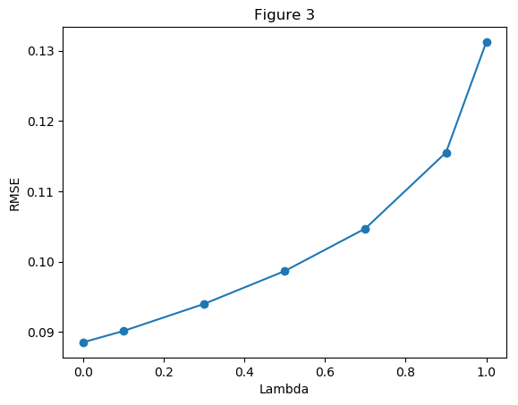
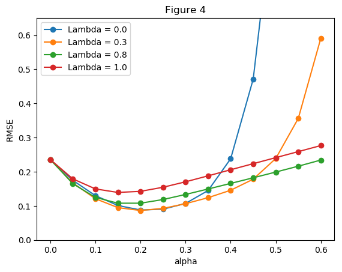
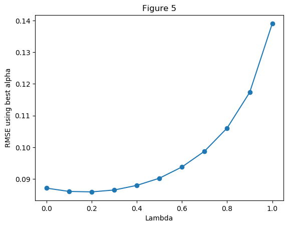

# Replicating Sutton 1988

## Introduction

In this project, I replicate the experiments used by Sutton in “Learning to Predict by the Methods of Temporal Differences” [Sutton, 1988]. Sutton performs two experiments and produces a number of figures using a bounded Random Walk as a simple example. His experiments show the performance difference between TD(1) (the Widrow-Hoff supervised learning rule) and TD(lambda). TD(lambda) outperforms TD(1) in both experiments (for some value of lambda < 1). I successfully reproduce the figures and explain the implementation used to recreate the experiments.

[Sutton's full paper](/sutton-88-with-erratum.pdf)
[Original Project Requirments](/CS7642_Project1.pdf)
[Project Report](/Project1-gth836x.pdf)

## The Project
Python Files:
- RandomWalk.py
- Figure3.py
- Experiment2.py
- Figure4.py
- Figure5.py

### RandomWalk.py
- Contains the randomWalk function.
- When called, this function returns a single random walk.

### Figure3.py

- Implements numpy, random, and matplotlib. Also implements the randomWalk function above.
- Seeded with random.seed(1)
- Initially creates 100 training sets of 10 randomWalk sequences.
-Loops through each training set with a set of lambdas to compute RMSE for each lambda, repeating until convergence (Experiment 1).
- Plots RMSE vs Lambda and outputs to file (Sutton Figure 3).

### Experiment2.py
- Contains the ExperimentTwo function.
- When called, this function returns the weight calculated by the TD equation for the given randomWalk sequence, lambda, and alpha.

### Figure4.py

- Implements numpy, random, and matplotlib. Also implements the randomWalk and ExperimentTwo functions above.
- Seeded with random.seed(1)
- Initially creates 100 training sets of 10 randomWalk sequences.
- Loops through each training set with a set of lambdas and alphas to compute RMSE for each lambda-alpha combination (Experiment 2).
- Plots RMSE vs alpha for each lambda and outputs to file (Sutton Figure 4).

### Figure5.py

- Implements numpy, random, and matplotlib. Also implements the randomWalk and ExperimentTwo functions above.
- Seeded with random.seed(1)
- Initially creates 100 training sets of 10 randomWalk sequences.
- Loops through each training set with a set of lambdas and alphas to compute RMSE for each lambda-alpha combination (Experiment 2).
- Identifies best RMSE for each lambda.
- Plots RMSE vs lambda and outputs to file (Sutton Figure 5).